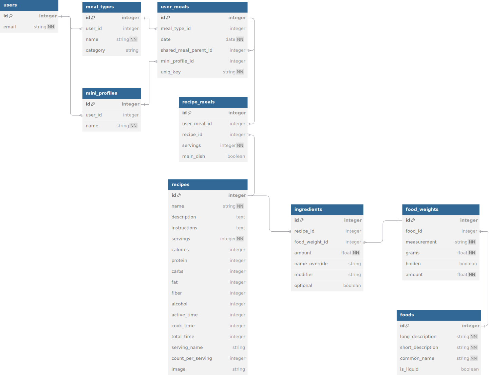

# Introduction

The Strongr Fastr for Professionals API allows enterprise users to programmatically create new clients in Strongr Fastr. Currently, client creation is the only publicly available endpoint. If your business needs something more please contact [philip@strongrfastr.com](mailto:philip@strongrfastr.com). The API is a work in progress and we're happy to help.

# Authentication

Authenticate each request by setting the Authorization header of the request to your API key as follows:

`Authorization: YOUR_API_KEY`

If you are the primary owner of the account and your account has been activated for API access your API Key should be visible within the app under Menu > Account. To get activated for API access contact [philip@strongrfastr.com](mailto:philip@strongrfastr.com).

# Content Type

Requests to the API should have a JSON body and content-type (‘application/json’). All responses from the API will also have a JSON body and content-type.

`Content-Type: application/json`

# Clients

## Create a Client

> Minimal create client request if delivering via PDF:

```json
{  
    "user": {  
        "first_name": "John",  
        "last_name": "Smith"
    }  
}
```

> Minimal create & invite a client if delivering via app/web:

```json
{  
    "type": "invite",
    "user": {  
        "first_name": "John",  
        "last_name": "Smith",
        "email": "johnsmith@example.com"
  }  
}
```

> If delivering via PDF: create & invite client and have them set up their own profile, meal plan preferences, and pick some initial recipes. Then generate and deliver them a meal plan:

```json
{  
    "type": "invite",
    "user": {  
        "first_name": "John",  
        "last_name": "Smith",
        "email": "johnsmith@example.com",
        "setup_own_profile": true,
        "setup_own_mp_prefs": true,
        "can_pick_initial_recipes": true,
        "auto_deliver_mp_pdf": true
  }  
}
```

> If deliver by app/web: create & invite client and have them set up their own profile, meal plan, and workouts:

```json
{  
    "type": "invite",
    "user": {  
        "first_name": "John",  
        "last_name": "Smith",
        "email": "johnsmith@example.com",
        "setup_own_profile": true,
        "setup_own_mp_prefs": true,
        "pick_own_routine": true
  }  
}
```

> Create client with basic profile:

```json
{
   "type": "invite",
   "user": {
       "first_name": "Jane",
       "last_name": "Smith",
       "email": "johnsmith@example.com",
       "gender": 1,
       "age": 32,
       "foot_height": 5,
       "inch_height": 6,
       "current_weight": 149,
       "weight_goal": -1,
       "activity_level": 2
   }
}
```

> Create client with basic profile & meal plan profile & generate first meal plan immediately (and email the client a PDF if delivering via PDF):

```json
{
   "type": "create",
   "generate_meal_plan": true,
   "user": {
       "first_name": "Jane",
       "last_name": "Smith",
       "email": "jane@example.com", 
       "auto_deliver_mp_pdf": true,
       "gender": 1,
       "age": 32,
       "foot_height": 5,
       "inch_height": 6,
       "current_weight": 149,
       "weight_goal": -1,
       "activity_level": 2,
       "meal_plan_weekday": 2,
       "diet_type": 1,
       "budget": 3,
       "weekly_variety": 3,
       "complexity_preference": 3,
       "selected_meal_types": ["breakfast","lunch","dinner"]
   }
}
```

> Create client with specific macro goals & food allergies:

```json
{
   "user": {
       "first_name": "Aaardvark",
       "last_name": "Tom",
       "gender": 1,
       "age": 32,
       "foot_height": 5,
       "inch_height": 6,
       "current_weight": 149,
       "weight_goal": -1,
       "activity_level": 2,
       "meal_plan_weekday": 2,
       "diet_type": 1,
       "budget": 3,
       "weekly_variety": 3,
       "complexity_preference": 3,
       "selected_meal_types": ["breakfast","lunch","dinner"],
       "excluded_keywords": "dairy1,soy1,gluten1",
       "extra_keywords": "brussel sprouts,lima beans",
       "override_calories": true,
       "calorie_override": 2200,
       "fiber_goal": 25,
       "macro_parameters": [
           { "macro": "protein", "amount": 180, "unit_type": 0, "compare_type": "at_least" },
           { "macro": "carbs", "amount": 20, "unit_type": 1, "compare_type": "at_most" }
       ]
   }
}
```

> This will create a lactose intolerant client (dairy1) who is also allergic to soy and gluten (soy1,gluten1) and does not want brussel sprouts or lima beans in their meal plan. They have a daily calorie goal of 2200 calories, a daily fiber goal of 25 grams, a daily protein goal of at least 180g, and a daily carbs goal of 20% or less.


This endpoint creates a new client.


### HTTP Request

`POST https://www.strongrfastr.com/en/api/v1/trainers/create_client`

### Request Body

-   **user** *object* (required) - the [user object](#user-object) with details (e.g. name, age, height, weight, etc) for the client being created
-   **trainer_identifier** *string* (optional) - the id or email address of the trainer/team member to whom this client should be assigned. If left blank, the client will be assigned to the account owner
-   **type** *string* (optional) - if specified must be one of:
	-   invite (if delivering plans via the app/website an invite will get sent to the client’s email address)
	-   create (default - creates the client without sending an invite)
-   **tags** *array of string* (optional) - an array of any tags (arbitrary strings for grouping clients) to be applied to the client. Can also be passed as a comma-delimited string.
-   **generate_meal_plan** *boolean* (optional) - if set to true, the client’s first meal plan will automatically be generated after the client is created. This will fail unless the meal_plan_weekday, diet_type, budget, weekly_variety, complexity_preference, and selected_meal_types fields are all set in the [user object](#user-object).
-   **suppress_notification_email** *boolean* (optional) - by default an email will be sent to the new client’s trainer after the client is created. Setting this flag to true prevents that email from being sent.
-   **delete_and_replace** *boolean* (optional) - by default if you already have a client with the same email address in our system, the call will error out and leave the existing client in place. If you set this flag to true, then the call will succeed and the pre-existing client will be deleted.

### Response

If the request succeeds the response will be an object with the following key/value pairs:

-   **client_id** *integer* - the id of the newly created client 
-   **mp_pdf_url** *string* - if generate_meal_plan was set to true, a url where a PDF of the plan can be downloaded will be provided here. A simple GET request to this URL with the appropriate Authorization header (see above) will return the PDF file

If the request fails, the response will be an object with an error message:

-   **error** *string* - the error message


### <a id="user-object"></a>User Object

#### Basic Fields
When creating a client, if you provide a first_name, last_name, gender, age, height (foot_height/inch_height or metric_height), weight (current_weight or metric_weight), weight_goal, and activity_level, then the manual “Set Up Client” step can be skipped within the app.

-   **first_name** *string* (required) - the client’s first name
-   **last_name** *string* (required) - the client’s last name
-   **email** *string* (optional if you’re delivering plans via “pdf” and both setup_own_profile and auto_deliver_mp_pdf are false, required otherwise) - client’s email address
-   **assign_default_forms** *boolean* (optional) - if you've set up default forms, check-ins, & assessments within the app set this flag to true and those will be assigned to the client upon creation
-   **setup_own_profile** *boolean* (optional) - set to true to have the client fill in their own gender, weight goal, age, height, weight, and activity level when they accept their invite
-   **gender** *integer* (optional) - 0 for male, 1 for female
-   **age** *integer* (optional) - the client’s age as an integer, must be >= 18 and <= 99
-   **foot_height** *integer*, **inch_height** *number* (optional) - the client’s height in feet and inches. inch_height should be blank or a number >= 0 and < 12. foot_height must be an integer. Total height must be between 2’6” and 8’
-   **metric_height** *number* (optional) - the client’s height in centimeters. This field is ignored if foot_height or inch_height are present. Must be between 77 and 243 cm.
-   **current_weight** *number* (optional) - the client’s current weight in lbs. Must be >= 60 and <= 800
-   **metric_weight** *number* (optional) - the client’s weight in kgs. Must be between 28 and 363 kgs. This field is ignored if current_weight is present
-   **weight_goal** *integer* (optional) - the client’s weight goal. Must be either -1 (lose weight), 0 (maintain/tone), or 1 (gain weight).
-   **activity_level** *integer* (optional) - must be one of:
    -   0 (for sedentary)
    -   1 (for lightly active)
    -   2 (for moderately active)
    -   3 (for heavily active)
    -   4 (for extremely active)

#### Meal Plan Fields

-   **setup_own_mp_prefs** *boolean* (optional) - set to true to have the client fill in their own meal plan profile after they accept their invite.

-   **can_edit_own_meal_plan** *boolean* (optional) - set to true to allow clients to create and edit their own meal plans. Defaults to true. Does nothing if you’re delivering plans via PDF.

-   **can_pick_initial_recipes** *boolean* (optional) - if delivering by PDF and setup_own_mp_prefs is set to true, you can set this flag to true to enable the initial recipe picking step where clients can pick some recipes they'd like to show up on their meal plan. Does nothing if delivering by app.

-   **auto_deliver_mp_pdf** *boolean* (optional) - if delivering by PDF and setup_own_mp_prefs is set to true OR generate_meal_plan is set to true, you can set this flag to true and the app will automatically email the client a PDF of their plan using the default PDF export settings (including any note) set by this client's coach. If this flag is unset or set to false, the coach will have to manually deliver this client's meal plan by exporting from within the app. Does nothing if delivering by app.

<aside class="notice">
If any of the below meal plan fields are provided then the basic fields are required.
</aside>
If you provide meal_plan_weekday, diet_type, budget, weekly_variety, complexity_preference, and selected_meal_types then the manual meal plan settings setup step for the client can be skipped within the app.

-   **meal_plan_weekday** *integer* (optional) - indicates which weekday should be the first day of the client’s meal plan each week. <span style="color:red">**If this field is included then diet_type, budget, weekly_variety, complexity_preference, and selected_meal_types are all REQUIRED**</span>. Must be one of:
	-   0 (for Sunday)
	-   1 (for Monday)
	-   2 (for Tuesday)
	-   3 (for Wednesday)
	-   4 (for Thursday)
	-   5 (for Friday)
	-   6 (for Saturday)

-   **diet_type** *integer* (optional) - must be one of:
	-   0 (for no restriction)
	-   1 (for pescetarian)
	-   2 (for vegetarian)
	-   3 (for paleo)
	-   4 (for keto)
	-   5 (for vegan)

-   **budget** *integer* (optional) - an integer (0,1,2, or 3) indicating how high the client’s grocery budget is. 0 for the lowest possible budget and 3 for the highest. Generally this field should be maxed out to increase variety, but can also be a good way to modulate expenses for cost-sensitive clients

-   **weekly_variety** *integer* (optional) - an integer (0,1,2, or 3) indicating how much variety to include in the client’s meal plan (i.e. how often to switch up meals vs repeating them/eating leftovers meal prep style). 0 for the least amount of variety and the least amount of cooking, 3 for the most variety and most cooking.

-   **complexity_preference** *integer* (optional) - an integer (0,1,2, or 3) indicating the maximum level of recipe complexity to include in this client’s plan. Recipe complexity is a qualitative metric determined by ingredient counts and total time required by a recipe. 0 is the least complex and 3 is the most. Note that restricting complexity too much can reduce variety in the meal plan.

-   <a id="selected-meal-types"></a>**selected_meal_types** *array of strings* (optional) - an array indicating which meals to include in the client’s plan each day. At least two meal types must be specified. Possible values are:
	-   breakfast
	-   lunch
	-   dinner
	-   snack

-   **excluded_keywords** *string* (optional) - a comma-separated list of tags used for food allergy exclusions. Possible tags are:
	-   dairy1 (excludes high-lactose dairy from the meal plan)
	-   dairy2 (excludes all dairy from the meal plan)
	-   egg1 (excludes eggs from the meal plan)
	-   peanut1 (excludes peanuts from the meal plan)
	-   tree_nuts (excludes tree nuts from the meal plan)
	-   soy1 (excludes soy from the meal plan)
	-   gluten1 (excludes gluten from the meal plan)
	-   fish1 (excludes fish from the meal plan)
	-   shellfish1 (excludes shellfish from the meal plan)

-   **extra_keywords** *string* (optional) - a comma separated list of free-text keywords/phrases to exclude from the meal plan. For example, if this was set to “brussels sprouts,beef” the meal plan would never include any recipes whose name, description, or ingredients included the keyword “brussels sprouts” or “beef”. Important: these keywords should be as specific as possible. For example, instead of setting the field to “nightshade” you should set it to “tomato,pepper,potato,eggplant”.

-   **meal_type_daily_percentages** *object* (optional) - an object whose keys are the meal types included in [selected_meal_types](#selected-meal-types) and values are the percentage of the client’s daily calories that should be allocated to that meal type. For example, a value of { “breakfast”: 20, “lunch”: 30, “dinner”: 50 } would tell the meal planner to allocate 20%, 30%, and 50% of the client’s daily calories to breakfast, lunch, and dinner respectively.

-   **override_calories** *boolean* (optional) - if set to true, the meal planner will use the calorie goal specified in calorie_override for this client’s meal plan. Otherwise, calorie_override will be ignored and the client’s calorie goal will be calculated automatically based on their profile.

-   **calorie_override** *integer* (optional) - the client’s daily caloric needs. Must be between 600 and 5500 if specified. If this is not specified, or override_calories is not set to true, the client’s daily calories are calculated automatically based on their profile.
    
-   **fiber_goal** *integer* (optional) - how many grams of fiber the client should be eating per day. Must be between 0 and 40.
    
-   **macro_parameters** *array of objects* (optional) - an array representing the client’s daily macronutrient targets. Each object in the array represents a single macronutrient and its daily target. You can specify targets for up to two macronutrients. If an empty array is set, the client’s macro goals will be calculated automatically based on their profile. Each object should have the following fields:
	-   **macro** *string* (required) - the macro whose daily target is being specified. Must be one of:
		-   protein
		-   carbs
		-   fat
	-   **amount** *number* (required) - how much of the specified macro the client should be eating each day. This will either be interpreted as a percent of the client’s daily calories or a gram amount, depending on the value of unit_type.
	-   **unit_type** *integer* (required) - must be one of:
		-   0 - the amount field will be interpreted as grams
		-   1 - the amount field will be interpreted as a percentage of the client’s daily calories
	-   **compare_type** *string* (required) - must be one of:
		-   at_least - the client should be eating AT LEAST the specified amount of the macronutrient 
		-   at_most - the client should be eating AT MOST the specified amount of the macronutrient


#### Workout Plan Fields

-   **pick_own_routine** *boolean* (optional) - set to true to have client go through a guided workout selection flow and pick an appopriate routine from Strongr Fastr's database of routines.

# Meal Plans - coming soon

## List meal plans

> Example Response

```json
{
    "user_id": 795326,
    "meal_plan_list": [
        {
            "id": 82,
            "week_start_date": "2567-07-26",
            "resolved_name": "Week 1",
            "published": true,
            "hidden": null
        },
        {
            "id": 83,
            "week_start_date": "2567-08-02",
            "resolved_name": "Week 2 - contest prep",
            "published": false,
            "hidden": null
        }
    ]
}
```

This endpoint will return metadata for all meal plans for a given client. The metadata includes the id of each meal plan which can be used to retrieve the full plan and its grocery list. The list will be sorted in ascending order of the "start date" of each meal plan.

### HTTP Request

`GET https://www.strongrfastr.com/en/api/v1/meal_plans/list`

### Request Body

-   **client_identifier** *string or integer* (required) - the id or email address of the client whose list of meal plans is being requested. Using the client's ID is recommended because a client's email is editable whereas its ID will never change.

### Response

If the request succeeds the response will be a JSON object with the following key/value pairs:

-   **user_id** *integer* - the id of the user/client this list is for
-   **meal_plan_list** *array of objects* - a list of meal plan metadata objects (see below)

### Meal Plan Metadata Object

Each meal plan metadata object will have the following keys:

-   **id** *integer* - the id of the meal plan
-   **week_start_date** *date string* - a YYYY-MM-DD formatted date representing the start date of the meal plan. The last day of a meal plan is always the start date plus 6 days so that each meal plan represents a full 7 days of meals. For internal architecture reasons, if your account is set up to deliver via "PDF" the start date for all meal plans will be a far future date, but the weekday will match whatever is set up in the client's settings.
-   **resolved_name** *string* - the display name of the meal plan (e.g. "Week 1")
-   **published** *boolean* - true if this meal plan has been marked as published by the trainer who created it
-   **hidden** *boolean* - if a meal plan has been "deleted" by the trainer who created it, it will still show up in API calls but this flag will be set to true

## Get meal plan

> Example get meal plan response:

```json
{
  "meal_types": {
    "1": {
      "id": 1,
      "user_id": 10,
      "name": "Breakfast",
      "category": "breakfast"
    },
    "2": {
      "id": 2,
      "user_id": 10,
      "name": "Lunch",
      "category": "lunch"
    }
    // Additional meal types...
  },
  "user_meals": {
    "100": {
      "id": 100,
      "meal_type_id": 1,
      "date": "2024-05-01",
      "shared_meal_parent_id": null,
      "mini_profile_id": null,
      "uniq_key": "abc123"
    }
    // Additional user meals...
  },
  "recipe_meals": {
    "1000": {
      "id": 1000,
      "user_meal_id": 100,
      "recipe_id": 500,
      "servings": 2,
      "main_dish": true
    }
    // Additional recipe meals...
  },
  "recipes": {
    "500": {
      "name": "Oatmeal Pancakes",
      "instructions": "Mix ingredients. \nCook on a skillet.",
      "servings": 4,
      "calories": 350,
      "protein": 10,
      "carbs": 50,
      "fat": 12,
      "fiber": 5,
      "alcohol": 0,
      "active_time": 15,
      "cook_time": 20,
      "serving_name": "pancake",
      "count_per_serving": 2,
      "image": { 
        "url": "https://www.strongrfastr.com/images/oatmeal_pancakes.jpg", 
        "thumb": { "url": "https://www.strongrfastr.com/images/oatmeal_pancakes_thumb.jpg" },
        "medium_thumb": { "url": "https://www.strongrfastr.com/images/oatmeal_pancakes_medium_thumb.jpg" }
      }
    }
    // Additional recipes...
  },
  "ingredients": {
    "2000": {
      "id": 2000,
      "recipe_id": 500,
      "food_weight_id": 300,
      "amount": 1.5,
      "modifier": "chopped",
      "optional": false
    }
    // Additional ingredients...
  },
  "food_weights": {
    "300": {
      "id": 300,
      "food_id": 400,
      "measurement": "cups",
      "grams": 150,
      "hidden": false
    }
    // Additional food weights...
  },
  "foods": {
    "400": {
      "id": 400,
      "long_description": "Whole grain rolled oats",
      "short_description": "WHL GRN RLD OATS",
      "common_name": "rolled oats",
      "is_liquid": false
    }
    // Additional foods...
  },
  "mini_profiles": {
    "5": {
      "id": 5,
      "user_id": 10,
      "name": "John"
    }
    // Additional mini profiles...
  }
}
```

This endpoint retrieves all data for a specific meal plan identified by its `id` for a given client. The response is a normalized JSON object that includes comprehensive information about all meals, recipes, foods in the meal plan. 

Meal plans are represented by many types of interrelated objects, below is an entity relationship diagram illustrating the general structure of a meal plan. Find more information about each type of object in the [Response Object Definitions](#mp-resp-objs-defs) section.



### HTTP Request

`GET https://www.strongrfastr.com/en/api/v1/meal_plans/get`

### Request Body

- **client_identifier** *string or integer* (required)  
  The ID or email address of the client whose meal plan is being requested. Using the client's ID is recommended because a client's email is editable whereas its ID will never change.

- **id** *integer* (required)  
  The unique identifier of the meal plan to retrieve. This ID corresponds to the `id` provided in the meal plans list.

### Response

If the request succeeds, the response will be a JSON object containing the following key/value pairs:

- **meal_types** *object* - a hash where each key is a `meal_type` ID and the value is a `Meal Type` object containing its attributes.

- **user_meals** *object* - a hash where each key is a `user_meal` ID and the value is a `User Meal` object containing its attributes.

- **recipe_meals** *object* - a hash where each key is a `recipe_meal` ID and the value is a `Recipe Meal` object containing its attributes.

- **recipes** *object* - a hash where each key is a `recipe` ID and the value is a `Recipe` object containing its attributes.

- **ingredients** *object* - a hash where each key is an `ingredient` ID and the value is an `Ingredient` object containing its attributes.

- **food_weights** *object* - a hash where each key is a `food_weight` ID and the value is a `Food Weight` object containing its attributes.

- **foods** *object* - a hash where each key is a `food` ID and the value is a `Food` object containing its attributes.

- **mini_profiles** *object* - a hash where each key is a `mini_profile` ID and the value is a `Mini Profile` object containing its attributes.

<a id="mp-resp-objs-defs"></a>
### Response Object Definitions

#### Meal Type Object

A `Meal Type` object represents a type of meal, either breakfast, lunch, dinner, or snack for the user that owns the meal type. Meals (i.e. `User Meals`) are assigned to a meal type and a date which determines their position in a plan.

- **id** *integer* - the unique identifier of the meal type.

- **user_id** *integer* - the ID of the user/client who owns this meal type.

- **name** *string* - the name of the meal type (e.g., "Breakfast", "Lunch").

- **category** *string* - the category to which the meal type belongs. It will always be one of ["breakfast","lunch","dinner","snack"]

#### Mini Profile Object

A `Mini Profile` represents a family member with whom meals on a meal plan might be shared.

- **id** *integer* - the unique identifier of the mini profile.

- **user_id** *integer* - the ID of the client/user associated with this mini profile.

- **name** *string* - the name of the person this mini profile is for e.g. "John" or "My husband".

#### User Meal Object

A `User Meal` object is the top-level object representing each meal on a plan. It is made up of 1 or more child `Recipe Meal` objects that define a recipe and number of servings of that recipe to be eaten. Broadly there are two types of `User Meals`:

*Regular user meals* - these are directly scheduled on the plan for the client with a date and a `Meal Type`. They are the meals the client themselves will be eating.

*Shared user meals* - these represent meals that will be eaten by the user/client's family members. They don't have a date or `Meal Type`, instead they point to a parent regular `User Meal` via the shared_meal_parent_id foreign key. They also point to the "family member" (`Mini Profile`) to whom they belong via the mini_profile_id foreign key.

- **id** *integer* - the unique identifier of the user meal.

- **meal_type_id** *integer* - the ID of the associated meal type.

- **date** *date string* - a YYYY-MM-DD formatted date representing when the meal is scheduled.

- **shared_meal_parent_id** *integer or null* - the ID of the parent meal if this is a "shared" user meal, null otherwise.

- **mini_profile_id** *integer* - the ID of the mini profile associated with this meal if this is a "shared" user meal, null otherwise.

- **uniq_key** *string* - the unique key is a string that can be used to group identical meals across days together. In other words, if a user is eating the same breakfast multiple days in a week, all those breakfasts will be represented by separate user meal objects, but they will all have the same uniq_key.

- **off_plan** *boolean* - if true this is an off plan meal, in other words a flexible meal where the user can eat whatever they want as long as it hits certain macronutrient targets. Off plan meals don't have any recipe meals associated with them. Off plan meals also have calorie, protein, carbs, fat, and fiber attributes indicating the macros the user should shoot for. These attributes should be ignored for refular user meals

- **calories** *float* - for off plan meals only, the total number of calories the user should shoot for. For regular user meals this will be null, and the calories and other macros should be calculated from the macros of the recipes in the meal.

- **protein** *float* - for off plan meals only, the total grams of protein the user should shoot for. For regular user meals, the macros should be calculated from the macros of the recipes in the meal.

- **carbs** *float* - for off plan meals only, the total grams of NET carbs the user should shoot for. For regular user meals, the macros should be calculated from the macros of the recipes in the meal.

- **fat** *float* - for off plan meals only, the total grams of fat the user should shoot for. For regular user meals, the macros should be calculated from the macros of the recipes in the meal.

- **fiber** *float* - for off plan meals only, the total grams of fiber the user should shoot for. For regular user meals, the macros should be calculated from the macros of the recipes in the meal.


#### Recipe Meal Object

`Recipe Meal` objects are the children of a `User Meal` object that define a recipe and number of servings of a recipe to be eaten.

- **id** *integer* - the unique identifier of the recipe meal.

- **user_meal_id** *integer* - the ID of the associated user meal.

- **recipe_id** *integer*  - the ID of the recipe included in this meal.

- **servings** *float*  - the number of servings for the recipe in this meal.

- **main_dish** *boolean* - if set to true, this recipe meal should be considered the main dish for its parent user meal. For example, if a lunch was a Turkey Sandwich and an Apple, the Turkey Sandwich would be marked as the main dish. This is helpful for emphasizing the most important part of the meal in your UI.

#### Recipe Object

The `Recipe` object represents an *unscaled* recipe. A recipe has many `Ingredient` children that define the foods and quantities of those foods in the recipe. A single recipe can be present in many `Recipe Meals` throughout the plan and when appropriate (most of the time) ingedient quantities should be scaled by the number of servings being used. Note that many "recipes" are actually just single food items like an Apple, so instructions may not be present for all recipes:

- **name** *string* - the name of the recipe.

- **instructions** *string* - step-by-step instructions for preparing the recipe. Each step is separated by a newline character (\n). This field can be null or a blank string for simple "recipes" that require no instruction.

- **servings** *integer* - this is the number of servings the unscaled recipe yields. Use this in combination with the servings attribute of recipe meals to figure out how much a recipe needs to be scaled for a given meal.

- **calories** *float* - the total number of calories per serving.

- **protein** *float* - the amount of protein (in grams) per serving.

- **carbs** *float* - the amount of NET carbohydrates (in grams) per serving. This is carbohydrates with fiber subtracted. To get total carbohydrates, add back the fiber amount. 

- **fat** *float* - the amount of fat (in grams) per serving.

- **fiber** *float* - the amount of fiber (in grams) per serving.

- **alcohol** *float* - the amount of alcohol (in grams) per serving.

- **active_time** *integer* - the active preparation time (in minutes).

- **cook_time** *integer* - the cooking time (in minutes).

- **serving_name** *string* - the name used to describe a single serving (e.g., "slice", "cup").

- **count_per_serving** *integer* - the number of items per serving. For example, if the serving for a pizza recipe is "2 slices" the serving name is "slices" and the count per serving would be 2. For most recipes this is 1 or null (which can be treated as the same thing).

- **image** *object* - the image is an object with the following keys:
	-   **url** *string* - the URL of the full resolution image for this recipe
	-   **thumb** *object* - an object with a single key "url" with the url of the thumbnail (200x133px) for this image 
    -   **medium_thumb** *object* - an object with a single key "url" with the url of the medium thumbnail (500x333px) for this image 

#### Ingredient Object

An `Ingredient` object belongs to a recipe and defines the amount of a food to be included in the parent recipe. Ingredients don't point directly to `Foods`, however. Instead they point to a `Food Weight` and define an amount of that food measurement to be used. For example, an ingredient might have an "amount" of 3 and point to a food weight that represents a cup of diced chicken breast, which means the parent recipe has 3 cups of diced chicken breast.

- **id** *integer* - the unique identifier of the ingredient.

- **recipe_id** *integer* - the ID of the recipe to which this ingredient belongs.

- **food_weight_id** *integer* - the ID of the associated food weight.

- **amount** *float* - the quantity of the food weight required.

- **modifier** *string* - any modifier or descriptor for the ingredient (e.g., "chopped", "fresh").

- **optional** *boolean* - indicates whether the ingredient is optional.

#### Food Weight Object

A `Food Weight` represents a specific measurement of a food and its weight in grams. For example, the `Food` almonds might have food weights for a cup, a single almond, an ounce, a gram, etc. A food weight belongs to a single food, but it can be used by many ingredients. 

- **id** *integer* - the unique identifier of the food weight.

- **food_id** *integer* - the ID of the associated food item.

- **measurement** *string* - the unit of measurement for the food weight (e.g., "grams", "ounces", "cups").

- **grams** *float* - the weight in grams of this quantity/measurement of the associated food.

- **hidden** *boolean* - indicates whether this measurement should be hidden in recipes. This is usually only true if the "measurement" is redundant with the name of the food. E.g. the Apple food item might have a food weight whose measurement is a "medium apple", which doesn't need to be displayed because "1 Apple" is clearer than "1 medium apple Apple".

#### Food Object

A `Food` object represents a food item like apples, salt, chicken, ground beef, etc. Every food item has 1 or more `Food Weights`.

- **id** *integer* - the unique identifier of the food item.

- **common_name** *string* - the common, human-readable name of the food item. This is what should be displayed to users the vast majority of the time.

- **long_description** *string* - this is the fully qualified name of the food. For example, for ground beef this might be "ground beef, grade A, 80% lean 20% fat"

- **short_description** *string* - same as the long description but uses abbreviations.

- **is_liquid** *boolean* - if true, indicates the food item is a liquid and can/should be measured in milliliters instead of grams.

## Get grocery list

> Example Response

```json
{
    "grocery_list": {
        "start_date": "2567-07-26",
        "needed": [
            {
                "name": "Beverages",
                "grocery_items": [
                    {
                        "recipe_meal_ids": [
                            45490308,
                            45490310,
                            45490312,
                            45490314,
                            45490316,
                            45490318
                        ],
                        "food_weight_id": 15975,
                        "food_id": 14066,
                        "amount": 0.24
                    },
                    {
                        "recipe_meal_ids": [
                            45490308,
                            45490310,
                            45490312,
                            45490343,
                            45490346,
                            45490349,
                            45490352
                        ],
                        "food_weight_id": 15537,
                        "food_id": 93634,
                        "amount": 8.33
                    }
                ]
            },
            {
                "name": "Nut and Seed Products",
                "grocery_items": [
                    {
                        "recipe_meal_ids": [
                            45490307,
                            45490309,
                            45490311,
                            45490313,
                            45490315,
                            45490317
                        ],
                        "food_weight_id": 6827,
                        "food_id": 12061,
                        "amount": 3.35
                    },
                    {
                        "recipe_meal_ids": [
                            45490313,
                            45490315,
                            45490317
                        ],
                        "food_weight_id": 6966,
                        "food_id": 12195,
                        "amount": 2.0
                    },
                    {
                        "recipe_meal_ids": [
                            45490356,
                            45490358,
                            45490360,
                            45490362
                        ],
                        "food_weight_id": 16153,
                        "food_id": 12036,
                        "amount": 5.0
                    }
                ]
            }
            // Additional categories...
        ],
        "bought": []
    }
}
```

This endpoint retrieves the grocery list associated with a specific meal plan for a given client. The response provides detailed information about the required grocery items, categorized by their respective food groups, along with any items that have already been purchased.

### HTTP Request

`GET https://www.strongrfastr.com/en/api/v1/meal_plans/get_grocery_list`

### Request Body

- **client_identifier** *string or integer* (required) - the ID or email address of the client whose grocery list is being requested. Using the client's ID is recommended because a client's email is editable whereas its ID will never change.

- **id** *integer* (required) - the unique identifier of the meal plan for which the grocery list is to be retrieved. This ID corresponds to the `id` provided in the meal plans list.

### Response

If the request succeeds, the response will be a JSON object containing the following key/value pairs:

- **grocery_list** *object* - an object containing the grocery list details, including the start date, needed items, and bought items.

### Response Object Definitions

#### Grocery List Object

The `Grocery List` object includes the following attributes:

- **start_date** *date string* - a YYYY-MM-DD formatted date representing the start date of the meal plan for which the grocery list is generated.

- **needed** *array of Category Objects* - a list of categories, each containing the grocery items required for that category.

- **bought** *array of Category Objects* - a list of categories containing grocery items that have already been purchased.

#### Category Object

Each `Category` object includes the following attributes:

- **name** *string* - the name of the grocery category (e.g., "Beverages", "Vegetables and Vegetable Products").

- **grocery_items** *array of Grocery Item Objects* - a list of grocery items required or bought within this category.

#### Grocery Item Object

Each `Grocery Item` object includes the following attributes:

- **recipe_meal_ids** *array of integers* - a list of `Recipe Meal` IDs that require this grocery item. This helps in identifying which meals utilize the ingredient.

- **food_weight_id** *integer* - the unique identifier for the food weight, linking to the `Food Weight` object associated with this grocery list item.

- **food_id** *integer*  - the unique identifier for the food item, linking to the `Food` object associated with this grocery list item.

- **amount** *float* - the quantity of the `Food Weight` required

